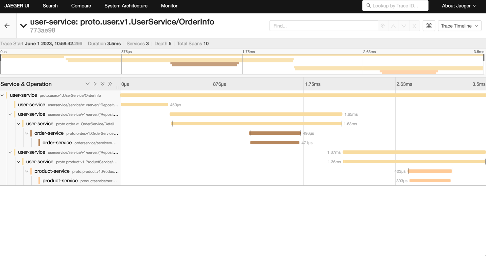
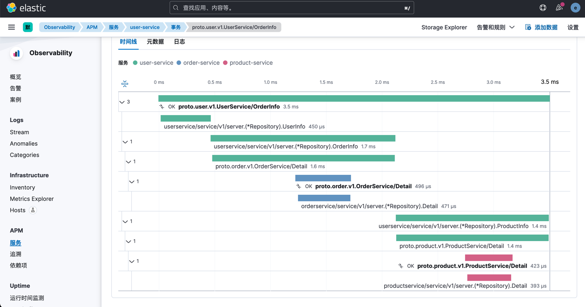
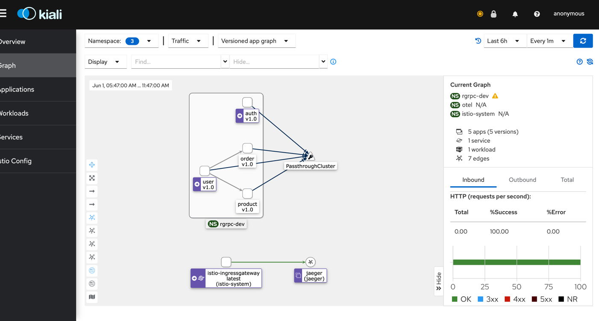

# Jgrpc-example [作者博客地址：https://janrs.com]

加入微信技术交流群：https://janrs.com/join/

---

本项目基于 https://github.com/janrs-io/Jgrpc 微服务最佳实践写的几个案例。基本包含了开发中会需要用到的实践代码，包含以下：

- 使用 `gorm` 作为 `ORM`
- 使用 `dtm` 作为事务处理
- 统一的 `grpc` 返回以及自动解析到 `http`
- 使用了 `istio` 的外部扩展鉴权[可以做token鉴权以及rbac鉴权和接口白名单]
- 实现了 `otel` 收集链路信息上报到 `jeager`
- 实现了 `otel` 将链路数据上报到 `ELK`

除了提供基于 `grpc-gateway` 开发微服务的案例代码外，还有基于 `Gitlab/Jenkins/Harbor/K8s` 的 `DevOps`。`DevOps`
流程可以参考我的博客，地址：https://janrs.com/category/cicd/

---

**本项目仅提供一个 `Demo` 案例代码用于学习**

*本项目需要使用 `k8s` 集群才能跑通。如果是本地启动服务的话，需要把每个服务的客户端以及服务端的端口都改成不一样的。*

---

# 已开发以下功能

## `istio` 外部扩展 `ext-authz` 鉴权服务

- token 鉴权功能
- 接口白名单功能

## `user` 用户服务

- 用户注册功能
- 用户登录功能
- 用户退出功能
- 获取用户详情功能
- 获取用户订单详情[该接口会调用user-grpc/order-grpc/product-grpc接口]

## `product` 产品服务

- 添加产品
- 删除产品
- 获取产品详情
- 获取产品列表

## `order` 订单服务

- 添加订单功能 [增加了 `DTM` 事务支持。创建订单会使用 `DTM` 的 `SAGA` 事务扣除产品库存]
- 获取订单详情功能

---

## 链路截图

**如果觉得对你的学习有帮助，点个 `star`**